# Architecture Diagrams

Visual representations of the OCI Free Tier infrastructure architecture, automation workflows, and deployment processes.

## Table of Contents

1. [Automation Flow](#automation-flow)
   - [Simplified Overview](#simplified-automation-flow)
   - [Detailed Flow](#detailed-automation-flow)
2. [Talos Kubernetes Architecture](#talos-kubernetes-architecture)
   - [Simplified View](#simplified-talos-architecture)
   - [Detailed Deployment](#detailed-talos-deployment)
3. [Terraform Components](#terraform-components)
   - [Simplified Layer View](#simplified-terraform-layers)
   - [Detailed Component View](#detailed-terraform-components)

---

## Automation Flow

### Simplified Automation Flow

High-level overview of the deployment pipeline from setup to production.

### Detailed Automation Flow

Each phase broken down into key steps. Click through phases to see the full workflow.

#### Phase 0: Setup

```mermaid
%%{init: {'theme':'forest'}}%%
flowchart LR
    A["task setup"] --> B{"OCI CLI?"}
    B -->|Missing| C["oci setup config"]
    B -->|Exists| D["Generate<br/>terraform.tfvars"]
    C --> D
    D --> E["SSH Keys<br/>~/.ssh/oci_key"]
    
    F["task setup:flux"] --> G["Generate<br/>Cilium Manifest"]
    G --> H["Age Key<br/>SOPS Config"]
    H --> I["Encrypt<br/>Tailscale Secret"]
    I --> J["✓ Ready"]
    
    E --> J
    
    classDef success fill:#2d5016,stroke:#5a9216,stroke-width:2px,color:#fff
    class J success
```

#### Phase 1: Image Building

```mermaid
%%{init: {'theme':'forest'}}%%
flowchart LR
    A["task build:images"] --> B["Dagger:<br/>Base Image"]
    B --> C["base-hardened.qcow2<br/><8GB"]
    
    A --> D["Dagger:<br/>Proxmox Image"]
    D --> E["proxmox-ampere.qcow2<br/><10GB"]
    
    C --> F{"Total<br/><20GB?"}
    E --> F
    F -->|Yes| G["Upload to<br/>OCI Storage"]
    F -->|No| H["❌ Too Large"]
    
    G --> I["Create<br/>Custom Images"]
    I --> J["✓ OCIDs Ready"]
    
    classDef success fill:#2d5016,stroke:#5a9216,stroke-width:2px,color:#fff
    classDef error fill:#8b0000,stroke:#ff0000,stroke-width:2px,color:#fff
    class J success
    class H error
```

####Phase 2: OCI Infrastructure

#### Phase 3: Proxmox Cluster

#### Phase 4: Talos Kubernetes

#### Phase 5: Validation

---

## Talos Kubernetes Architecture

### Simplified Talos Architecture

High-level view of Talos deployment on Proxmox.

### Detailed Talos Deployment

Complete deployment flow with bootstrap sequence and GitOps integration.

---

## Terraform Components

### Simplified Terraform Layers

Three-layer architecture with intervention points.

### Detailed Terraform Components

Complete resource graph with dependencies.

---

## Resource Dependencies

Detailed dependency flow across all three Terraform layers.

---

## Cost Verification Flow

How the free tier limits are enforced and validated.

---

## Network Topology

Physical and logical network layout.

```mermaid
graph TB
    subgraph "Internet"
        A[Public Internet]
    end
    
    subgraph "OCI VCN: 10.0.0.0/16"
        B[Internet Gateway<br/>free_tier_igw]
        C[Route Table<br/>0.0.0.0/0 → IGW]
        D[Security List<br/>SSH/HTTP/HTTPS/ICMP]
        E[Subnet: 10.0.1.0/24]
        
        B --> C
        C --> E
        D --> E
    end
    
    subgraph "Compute Instances"
        F[Ampere 1: 10.0.1.10<br/>Proxmox Node 1<br/>Public: ephemeral]
        G[Ampere 2: 10.0.1.11<br/>Proxmox Node 2<br/>Public: ephemeral]
        H[Ampere 3: 10.0.1.12<br/>Proxmox Node 3<br/>Public: ephemeral]
        I[Micro: 10.0.1.20<br/>Bastion<br/>Public: Reserved IP #1]
        
        E --> F
        E --> G
        E --> H
        E --> I
    end
    
    subgraph "Tailscale Mesh (100.x.x.x)"
        J[Tailscale LXC 1<br/>100.64.0.1]
        K[Tailscale LXC 2<br/>100.64.0.2]
        L[Tailscale LXC 3<br/>100.64.0.3]
        M[Bastion Tailscale<br/>100.64.0.4]
        
        F -.-> J
        G -.-> K
        H -.-> L
        I -.-> M
        
        J -.mesh.-> K
        K -.mesh.-> L
        L -.mesh.-> M
        M -.mesh.-> J
    end
    
    subgraph "Talos VMs (Proxmox Bridge)"
        N[Talos CP 1<br/>10.0.1.100<br/>on Proxmox 1]
        O[Talos CP 2<br/>10.0.1.101<br/>on Proxmox 2]
        P[Talos CP 3<br/>10.0.1.102<br/>on Proxmox 3]
        
        F --> N
        G --> O
        H --> P
    end
    
    subgraph "Kubernetes Services"
        Q[Cilium CNI<br/>10.244.0.0/16 pods<br/>10.96.0.0/12 services]
        R[Ingress Controller<br/>1:1 NAT via Reserved IP #2]
        
        N --> Q
        O --> Q
        P --> Q
        Q --> R
    end
    
    A --> B
    A -.SSH.-> I
    A -.HTTP/HTTPS.-> R
    
    style A fill:#e3f2fd
    style B fill:#ffe0b2
    style E fill:#c8e6c9
    style F fill:#ffebee
    style G fill:#ffebee
    style H fill:#ffebee
    style I fill:#fff3e0
    style J fill:#e1f5fe
    style K fill:#e1f5fe
    style L fill:#e1f5fe
    style M fill:#e1f5fe
    style N fill:#e8f5e9
    style O fill:#e8f5e9
    style P fill:#e8f5e9
    style Q fill:#f3e5f5
    style R fill:#fff9c4
```

---

## Deployment Timeline

Estimated time for each phase.

**Estimated total time:** ~3 hours (including image builds)  
**Fastest path (pre-built images):** ~1 hour

---

## Legend

### Graph Colors

- **Blue** (`#e1f5ff`, `#e3f2fd`): Setup and initialization
- **Yellow** (`#fff9e1`, `#fff3e0`): Build and validation
- **Pink** (`#ffe1f5`, `#ffebee`): OCI infrastructure
- **Purple** (`#f5e1ff`, `#f3e5f5`): Proxmox configuration
- **Green** (`#e1ffe1`, `#e8f5e9`, `#c8e6c9`): Kubernetes/Talos
- **Red** (`#ffe1e1`, `#ffcdd2`): Errors or warnings
- **Amber** (`#fff9c4`): Monitoring and observability

### Abbreviations

- **OCI**: Oracle Cloud Infrastructure
- **VCN**: Virtual Cloud Network
- **CNI**: Container Network Interface
- **CCM**: Cloud Controller Manager
- **LXC**: Linux Container
- **SOPS**: Secrets OPerationS (encryption)
- **eBPF**: Extended Berkeley Packet Filter

---

## Related Documentation

- [PLAN.md](../PLAN.md) - Detailed deployment plan
- [QUICKSTART.md](./QUICKSTART.md) - Quick start guide
- [WARP.md](../WARP.md) - Architecture overview
- [nix-dagger-analysis.md](./nix-dagger-analysis.md) - Tooling comparison
