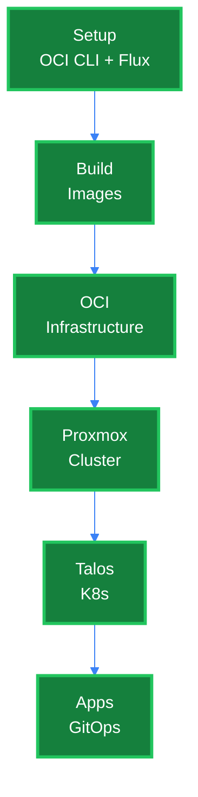
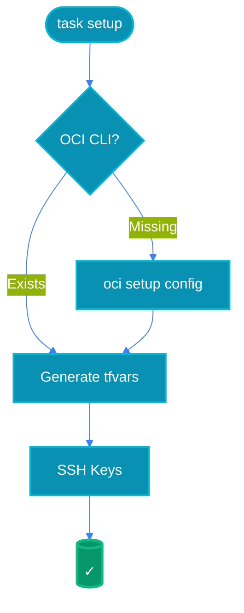
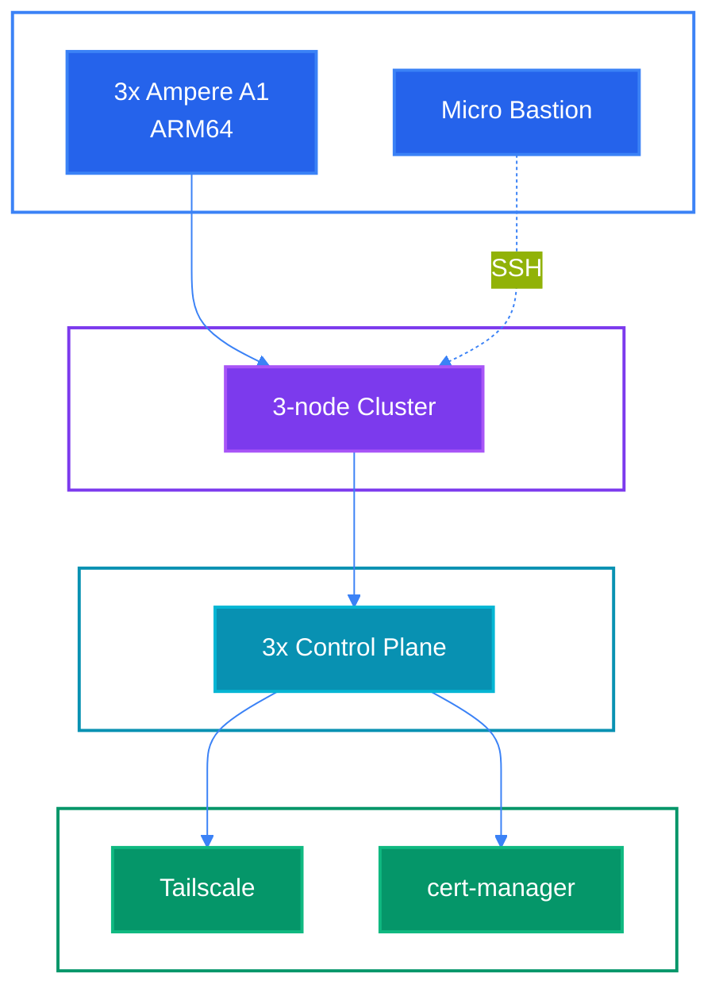

# Architecture Diagrams

Visual representations of the OCI Free Tier infrastructure. All diagrams use explicit color styling to ensure readability on both light and dark backgrounds.

## Table of Contents

### 1. [Deployment Pipeline](#deployment-pipeline)
   - [Complete Flow](#complete-flow)
   - [Phase 0: Setup](#phase-0-setup)
   - [Phase 2: OCI Infrastructure](#phase-2-oci-infrastructure)
   - [Phase 3: Proxmox Cluster](#phase-3-proxmox-cluster)

### 2. [Talos Kubernetes](#talos-kubernetes)
   - [Architecture Overview](#architecture-overview)

---

## Deployment Pipeline

### Complete Flow

This diagram shows the complete deployment pipeline from initial setup to running applications.

**Related files:** [`Taskfile.yml`](../Taskfile.yml), [`QUICKSTART.md`](./QUICKSTART.md)

### Phase 0: Setup

Initializes the development environment by configuring OCI CLI and setting up Flux GitOps.

**Related files:** [`scripts/setup.sh`](../scripts/setup.sh), [`scripts/setup-flux.sh`](../scripts/setup-flux.sh)

### Phase 2: OCI Infrastructure

Provisions Oracle Cloud Infrastructure resources within free tier limits.

**Related files:** [`tofu/oci/main.tf`](../tofu/oci/main.tf)

### Phase 3: Proxmox Cluster

Forms 3-node Proxmox cluster with Ceph storage.

**Related files:** [`tofu/proxmox-cluster/main.tf`](../tofu/proxmox-cluster/main.tf)

## Talos Kubernetes

### Architecture Overview

Complete technology stack from OCI instances to Kubernetes applications.

**Related files:** [`WARP.md`](../WARP.md#architecture)

