# Architecture Diagrams

Visual representations of the OCI Free Tier infrastructure using clean, readable Mermaid diagrams. All diagrams are optimized for both light and dark backgrounds, and sized to avoid horizontal scrolling.

## Table of Contents

### 1. [Deployment Pipeline](#deployment-pipeline)
   - [Complete Flow](#complete-flow)
   - [Phase 0: Setup](#phase-0-setup)
   - [Phase 1: Build Images](#phase-1-build-images)
   - [Phase 2: OCI Infrastructure](#phase-2-oci-infrastructure)
   - [Phase 3: Proxmox Cluster](#phase-3-proxmox-cluster)
   - [Phase 4: Talos Kubernetes](#phase-4-talos-kubernetes)
   - [Phase 5: Validation](#phase-5-validation)

### 2. [Talos Kubernetes](#talos-kubernetes)
   - [Architecture Overview](#architecture-overview)
   - [Bootstrap Sequence](#bootstrap-sequence)

### 3. [Terraform Layers](#terraform-layers)
   - [Three-Layer Architecture](#three-layer-architecture)
   - [Layer 1: OCI Resources](#layer-1-oci-resources)
   - [Layer 2: Proxmox Setup](#layer-2-proxmox-setup)
   - [Layer 3: Talos Deployment](#layer-3-talos-deployment)

### 4. [Network Architecture](#network-architecture)
   - [Physical + Logical Topology](#physical--logical-topology)
   - [IP Allocation Strategy](#ip-allocation-strategy)

### 5. [Cost Enforcement](#cost-enforcement)
   - [Free Tier Validation Flow](#free-tier-validation-flow)
   - [Validation Matrix](#validation-matrix)

### 6. [Deployment Timeline](#deployment-timeline)

### 7. [Legend](#legend)

---

## Deployment Pipeline

### Complete Flow

This diagram shows the complete deployment pipeline from initial setup to running applications. Each phase depends on the successful completion of the previous phase. The entire process takes approximately 3 hours including image builds, or 1 hour with pre-built images.

**Related files:** [`Taskfile.yml`](../Taskfile.yml), [`QUICKSTART.md`](./QUICKSTART.md)

```mermaid
%%{init: {'theme':'neutral', 'themeVariables': { 'lineColor': '#60a5fa', 'arrowheadColor': '#60a5fa' }, 'flowchart': { 'useMaxWidth': true, 'diagramPadding': 8, 'nodeSpacing': 16, 'rankSpacing': 24 } }}%%
flowchart TB
    Setup["⚙️ Setup<br/><small>OCI CLI + Flux</small>"] --> Build["🔨 Build<br/><small>Images</small>"]
    Build --> OCI["☁️ OCI<br/><small>Infrastructure</small>"]
    OCI --> Proxmox["🗄️ Proxmox<br/><small>Cluster</small>"]
    Proxmox --> Talos["🐧 Talos<br/><small>K8s</small>"]
    Talos --> Apps["📦 Apps<br/><small>GitOps</small>"]
    
    classDef phaseNode fill:#2d5016,stroke:#5a9216,stroke-width:3px,color:#fff,font-size:14px
    class Setup,Build,OCI,Proxmox,Talos,Apps phaseNode
```

### Phase 0: Setup

Initializes the development environment by configuring OCI CLI, generating SSH keys, creating terraform.tfvars, and setting up the Flux GitOps repository with SOPS encryption. This phase ensures all prerequisites are met before deploying infrastructure.

**Related files:** [`scripts/setup.sh`](../scripts/setup.sh), [`scripts/setup-flux.sh`](../scripts/setup-flux.sh)

```mermaid
%%{init: {'theme':'neutral', 'themeVariables': { 'lineColor': '#60a5fa', 'arrowheadColor': '#60a5fa' }, 'flowchart': { 'useMaxWidth': true, 'diagramPadding': 8, 'nodeSpacing': 16, 'rankSpacing': 24 } }}%%
flowchart TB
    Start(["task setup"]) --> CheckOCI{"OCI<br/>CLI?"}
    CheckOCI -->|Missing| InstallOCI["oci setup<br/>config"]
    CheckOCI -->|Exists| GenTF["Generate<br/>tfvars"]
    InstallOCI --> GenTF
    GenTF --> SSH["SSH Keys"]
    
    StartFlux(["task<br/>setup:flux"]) --> Cilium["Cilium<br/>Manifest"]
    Cilium --> Age["Age Key<br/>+ SOPS"]
    Age --> Encrypt["Encrypt<br/>Secrets"]
    
    SSH --> Done[("✓")]
    Encrypt --> Done
    
    classDef success fill:#2d5016,stroke:#5a9216,stroke-width:3px,color:#fff
    class Done success
```

### Phase 1: Build Images

Builds two custom images using Dagger: a base hardened Debian image with SSH and Tailscale, and a Proxmox image with PVE and Ceph packages. Both images must total less than 20GB to fit within OCI's free tier object storage limit.

**Related files:** [`packer/base-hardened.pkr.hcl`](../packer/base-hardened.pkr.hcl), [`packer/proxmox-ampere.pkr.hcl`](../packer/proxmox-ampere.pkr.hcl), [`dagger/src/main/__init__.py`](../dagger/src/main/__init__.py)

```mermaid
%%{init: {'theme':'neutral', 'themeVariables': { 'lineColor': '#60a5fa', 'arrowheadColor': '#60a5fa' }, 'flowchart': { 'useMaxWidth': true, 'diagramPadding': 8, 'nodeSpacing': 16, 'rankSpacing': 24 } }}%%
flowchart TB
    Start(["task<br/>build:images"]) --> Base["Base Image<br/><small>Debian 12</small>"]
    Start --> Proxmox["Proxmox Image<br/><small>+PVE +Ceph</small>"]
    
    Base --> Check{"< 20GB<br/>total?"}
    Proxmox --> Check
    
    Check -->|Yes| Upload["Upload to<br/>OCI Storage"]
    Check -->|No| Fail[("❌")]
    
    Upload --> Images["Custom<br/>Images"]
    Images --> Done[("✓")]
    
    classDef success fill:#2d5016,stroke:#5a9216,stroke-width:3px,color:#fff
    classDef error fill:#8b0000,stroke:#ff0000,stroke-width:3px,color:#fff
    class Done success
    class Fail error
```

### Phase 2: OCI Infrastructure

Provisions Oracle Cloud Infrastructure resources: VCN with networking components, 3 Ampere A1 instances (ARM64), and 1 E2.1.Micro bastion instance. All resources stay within free tier limits (4 OCPU, 24GB RAM, 200GB storage). Tailscale mesh network connects all nodes securely.

**Related files:** [`tofu/oci/main.tf`](../tofu/oci/main.tf), [`tofu/oci/variables.tf`](../tofu/oci/variables.tf)

```mermaid
%%{init: {'theme':'neutral', 'themeVariables': { 'lineColor': '#60a5fa', 'arrowheadColor': '#60a5fa' }, 'flowchart': { 'useMaxWidth': true, 'diagramPadding': 8, 'nodeSpacing': 16, 'rankSpacing': 24 } }}%%
flowchart LR
    Start(["task deploy:oci"]) --> Plan["tofu<br/>plan/apply"]
    Plan --> VCN["VCN +<br/>Networking"]
    VCN --> Compute["3x Ampere<br/>1x Micro"]
    Compute --> Mesh["Tailscale<br/>Mesh"]
    Mesh --> Done[("✓")]
    
    classDef success fill:#2d5016,stroke:#5a9216,stroke-width:3px,color:#fff
    class Done success
```

### Phase 3: Proxmox Cluster

Forms a 3-node Proxmox VE cluster using pvecm, then initializes Ceph distributed storage for VM live migration. The cluster provides high availability and shared storage across all nodes. Validation checks ensure cluster quorum and Ceph health before proceeding.

**Related files:** [`tofu/proxmox-cluster/main.tf`](../tofu/proxmox-cluster/main.tf), [`WARP.md`](../WARP.md#proxmox-cluster)

### Phase 4: Talos Kubernetes

Downloads Talos Linux images, creates 3 VMs on Proxmox, and automatically bootstraps a Kubernetes cluster. Cilium provides CNI in kube-proxy-free mode, Flux enables GitOps, and SOPS keys decrypt secrets. The entire K8s setup is fully automated via Terraform.

**Related files:** [`tofu/talos/talos-vms.tf`](../tofu/talos/talos-vms.tf), [`tofu/talos/talos-config.yaml.tpl`](../tofu/talos/talos-config.yaml.tpl)

```mermaid
%%{init: {'theme':'neutral', 'themeVariables': { 'lineColor': '#60a5fa', 'arrowheadColor': '#60a5fa' }, 'flowchart': { 'useMaxWidth': true, 'diagramPadding': 8, 'nodeSpacing': 16, 'rankSpacing': 24 } }}%%
flowchart LR
    Start(["task deploy:talos"]) --> VMs["Create<br/>VMs"]
    VMs --> Cilium["Deploy<br/>Cilium"]
    Cilium --> Flux["Deploy<br/>Flux"]
    Flux --> SOPS["Inject<br/>SOPS"]
    SOPS --> Apps["Apps<br/>Deploy"]
    Apps --> Done[("✓")]
    
    classDef success fill:#2d5016,stroke:#5a9216,stroke-width:3px,color:#fff
    class Done success
```

### Phase 5: Validation

Runs comprehensive checks across all deployment phases to ensure: images are within size limits, OCI resources match free tier constraints, Proxmox cluster has quorum, Talos nodes are ready, and billing shows $0.00. All validations must pass for successful deployment.

**Related files:** [`scripts/validate-*.sh`](../scripts/), [`Taskfile.yml`](../Taskfile.yml) (validate tasks)

---

## Talos Kubernetes

### Architecture Overview

Shows the complete technology stack from OCI bare metal instances through Proxmox virtualization to Talos Kubernetes and deployed applications. Three Ampere instances run Proxmox with Ceph storage, hosting Talos VMs that form the K8s cluster. A separate Micro instance serves as the SSH bastion.

**Related files:** [`WARP.md`](../WARP.md#architecture), [`PLAN.md`](../PLAN.md#infrastructure-configuration)

### Bootstrap Sequence

Detailed timeline of Talos K8s bootstrapping process. Terraform creates VMs on Proxmox, Talos boots and fetches Cilium CNI and Flux GitOps manifests from GitHub, then SOPS keys are injected for secret decryption. Flux continuously reconciles the cluster state with the Git repository.

**Related files:** [`tofu/talos/`](../tofu/talos/), [oci-free-tier-flux repo](https://github.com/syscode-labs/oci-free-tier-flux)

---

## Terraform Layers

### Three-Layer Architecture

Shows the three independent Terraform layers with intervention points between each. Each layer outputs state consumed by the next via remote state data sources. This separation allows independent deployment and destruction of each layer, with clear boundaries and rollback points.

**Related files:** [`tofu/oci/`](../tofu/oci/), [`tofu/proxmox-cluster/`](../tofu/proxmox-cluster/), [`tofu/talos/`](../tofu/talos/)

### Layer 1: OCI Resources

Detailed view of OCI networking and compute resources. The VCN provides network isolation, internet gateway enables external access, security list controls traffic, and budget alert monitors for any charges. All components are defined in `tofu/oci/main.tf`.

**Related files:** [`tofu/oci/main.tf`](../tofu/oci/main.tf), [`tofu/oci/data.tf`](../tofu/oci/data.tf)

### Layer 2: Proxmox Setup

Proxmox cluster provisioning workflow using SSH provisioners and Ansible. Reads OCI instance IPs from remote state, forms the cluster, configures Ceph for distributed storage, deploys Tailscale LXC containers for mesh networking, and tests VM live migration.

**Related files:** [`tofu/proxmox-cluster/main.tf`](../tofu/proxmox-cluster/main.tf), [`packer/scripts/tteck-post-install.sh`](../packer/scripts/tteck-post-install.sh)

### Layer 3: Talos Deployment

Talos Kubernetes deployment pipeline using the Proxmox Terraform provider. Downloads Talos nocloud image from factory.talos.dev, renders machine config template with Flux URLs, creates VMs with cloud-init, automatically bootstraps K8s, and injects SOPS Age key for secret decryption.

**Related files:** [`tofu/talos/talos-vms.tf`](../tofu/talos/talos-vms.tf), [`tofu/talos/flux-secrets.tf`](../tofu/talos/flux-secrets.tf), [`tofu/talos/talos-config.yaml.tpl`](../tofu/talos/talos-config.yaml.tpl)

---

## Network Architecture

### Physical + Logical Topology

Complete network architecture showing OCI VCN (10.0.0.0/16), compute instances with assigned IPs, Tailscale mesh overlay (100.x.x.x), and Kubernetes internal networks (pods at 10.244.0.0/16, services at 10.96.0.0/12). Traffic flows from internet through IGW to instances, with Tailscale providing secure mesh and K8s ingress handling public services.

**Related files:** [`tofu/oci/main.tf`](../tofu/oci/main.tf#L39-L126) (networking), [`WARP.md`](../WARP.md#networking-architecture)

```mermaid
%%{init: {'theme':'neutral', 'themeVariables': { 'lineColor': '#60a5fa', 'arrowheadColor': '#60a5fa' }, 'flowchart': { 'useMaxWidth': true, 'diagramPadding': 8, 'nodeSpacing': 16, 'rankSpacing': 24 } }}%%
graph TB
    Internet["🌐 Internet"]
    
    subgraph OCI_Net["OCI VCN: 10.0.0.0/16"]
        IGW["Internet<br/>Gateway"]
        Subnet["Subnet<br/>10.0.1.0/24"]
    end
    
    subgraph Instances["Compute Instances"]
        A1["Ampere 1<br/>10.0.1.10"]
        A2["Ampere 2<br/>10.0.1.11"]
        A3["Ampere 3<br/>10.0.1.12"]
        BAS["Bastion<br/>10.0.1.20<br/>Reserved IP"]
    end
    
    subgraph Mesh["Tailscale Mesh: 100.x.x.x"]
        TS1["100.64.0.1"]
        TS2["100.64.0.2"]
        TS3["100.64.0.3"]
        TS4["100.64.0.4"]
    end
    
    subgraph K8s_Net["K8s Network"]
        Pods["Pods<br/>10.244.0.0/16"]
        Svcs["Services<br/>10.96.0.0/12"]
        Ingress["Ingress<br/>Reserved IP #2"]
    end
    
    Internet --> IGW
    IGW --> Subnet
    Subnet --> A1 & A2 & A3 & BAS
    
    A1 -.-> TS1
    A2 -.-> TS2
    A3 -.-> TS3
    BAS -.-> TS4
    
    TS1 -.mesh.-> TS2 & TS3 & TS4
    
    A1 & A2 & A3 --> Pods
    Pods --> Svcs
    Svcs --> Ingress
    Ingress -.-> Internet
```

### IP Allocation Strategy

Explains how the 2 free reserved IPs are allocated: #1 for bastion SSH access, #2 for K8s ingress via 1:1 NAT on Proxmox. Ampere nodes use ephemeral IPs for setup, then rely on Tailscale mesh for internal communication. Unlimited internal services can be exposed via Tailscale without consuming public IPs.

**Related files:** [`WARP.md`](../WARP.md#ip-allocation-strategy), [`PLAN.md`](../PLAN.md#networking)

---

## Cost Enforcement

### Free Tier Validation Flow

Shows how free tier limits are enforced at multiple stages: Terraform variable validations prevent invalid configs, pre-deployment checks validate plans and image sizes, runtime budget alerts catch unexpected charges, and post-deployment validation confirms $0.00 billing across OCI and Grafana Cloud.

**Related files:** [`tofu/oci/variables.tf`](../tofu/oci/variables.tf) (validations), [`scripts/validate-cost.sh`](../scripts/validate-cost.sh)

```mermaid
%%{init: {'theme':'neutral', 'themeVariables': { 'lineColor': '#60a5fa', 'arrowheadColor': '#60a5fa' }, 'flowchart': { 'useMaxWidth': true, 'diagramPadding': 8, 'nodeSpacing': 16, 'rankSpacing': 24 } }}%%
graph TB
    subgraph Limits["Free Tier Limits"]
        C["Compute<br/>4 OCPU, 24GB"]
        S["Storage<br/>200GB"]
        N["Network<br/>2 Reserved IPs"]
        O["Objects<br/>20GB"]
    end
    
    subgraph TF_Val["Terraform Validations"]
        V1["variables.tf<br/>count ≤ 4"]
        V2["variables.tf<br/>ocpus ≤ 4"]
        V3["variables.tf<br/>ram ≤ 24GB"]
        V4["variables.tf<br/>storage ≤ 200GB"]
    end
    
    subgraph Checks["Pre-Deploy Checks"]
        Plan["tofu plan<br/>review"]
        Build["task build:validate<br/>< 20GB"]
    end
    
    subgraph Monitor["Runtime Monitor"]
        Budget["Budget Alert<br/>$0.01"]
        Email["Email on<br/>any charge"]
    end
    
    subgraph Validate["Post-Deploy"]
        Cost["task validate:cost"]
        Billing["OCI billing:<br/>$0.00"]
        Grafana["Grafana Cloud:<br/>within free tier"]
    end
    
    C & S & N & O --> V1 & V2 & V3 & V4
    V1 & V2 & V3 & V4 --> Plan & Build
    Plan & Build --> Budget
    Budget --> Email
    Email --> Cost
    Cost --> Billing & Grafana
    
    Billing --> Result{"$0.00?"}
    Grafana --> Result
    Result -->|Yes| Safe[("✅ Safe")]
    Result -->|No| Stop[("❌ STOP")]
    
    classDef success fill:#2d5016,stroke:#5a9216,stroke-width:3px,color:#fff
    classDef error fill:#8b0000,stroke:#ff0000,stroke-width:3px,color:#fff
    class Safe success
    class Stop error
```

### Validation Matrix

Simplified validation workflow showing all five checks (images, OCI, Proxmox, Talos, cost) that must pass for successful deployment. Runs via `task validate` command which executes individual validation scripts for each phase.

**Related files:** [`Taskfile.yml`](../Taskfile.yml#L175-L216) (validate tasks), [`scripts/validate-*.sh`](../scripts/)

```mermaid
%%{init: {'theme':'neutral', 'themeVariables': { 'lineColor': '#60a5fa', 'arrowheadColor': '#60a5fa' }, 'flowchart': { 'useMaxWidth': true, 'diagramPadding': 8, 'nodeSpacing': 16, 'rankSpacing': 24 } }}%%
flowchart TB
    V["task validate"] --> I["Images<br/><20GB"]
    V --> O["OCI<br/>free tier"]
    V --> P["Proxmox<br/>quorum"]
    V --> T["Talos<br/>ready"]
    V --> C["Cost<br/>$0.00"]
    
    I --> R{"All<br/>✓?"}
    O --> R
    P --> R
    T --> R
    C --> R
    
    R -->|Yes| Success[("✅")]
    R -->|No| Fail[("❌")]
    
    classDef success fill:#2d5016,stroke:#5a9216,stroke-width:3px,color:#fff
    classDef error fill:#8b0000,stroke:#ff0000,stroke-width:3px,color:#fff
    class Success success
    class Fail error
```

---

## Deployment Timeline

**Total time:** ~3 hours (with image builds) | ~1 hour (pre-built images)

---

## Legend

### Visual Elements

- **🌐 Internet** - Public internet
- **☁️ OCI** - Oracle Cloud Infrastructure
- **🗄️ Proxmox** - Proxmox VE hypervisor
- **🐧 Talos** - Talos Linux (immutable K8s OS)
- **📦 Applications** - Deployed workloads
- **✓** - Success state
- **❌** - Error/failure state

### Colors

- **Green (#2d5016)** - Success, ready state
- **Red (#8b0000)** - Error, failure state
- **Forest theme** - Professional, readable palette

### Abbreviations

- **OCI** - Oracle Cloud Infrastructure
- **VCN** - Virtual Cloud Network
- **IGW** - Internet Gateway
- **CNI** - Container Network Interface (Cilium)
- **PVE** - Proxmox Virtual Environment
- **LXC** - Linux Container
- **SOPS** - Secrets OPerationS (encryption)
- **CCM** - Cloud Controller Manager

---

## Related Documentation

- [PLAN.md](../PLAN.md) - Detailed deployment steps
- [QUICKSTART.md](./QUICKSTART.md) - Quick start guide
- [WARP.md](../WARP.md) - Complete architecture reference
- [Taskfile.yml](../Taskfile.yml) - All automation commands
