# Architecture Diagrams

Visual representations of the OCI Free Tier infrastructure using clean, readable Mermaid diagrams.

## Table of Contents

1. [Deployment Pipeline](#deployment-pipeline)
2. [Talos Kubernetes](#talos-kubernetes)  
3. [Terraform Layers](#terraform-layers)
4. [Network Architecture](#network-architecture)
5. [Cost Enforcement](#cost-enforcement)

---

## Deployment Pipeline

### Complete Flow

End-to-end deployment in 6 phases.

```mermaid
%%{init: {'theme':'forest'}}%%
flowchart LR
    Setup["⚙️ Setup<br/><small>OCI CLI + Flux</small>"] --> Build["🔨 Build<br/><small>Images</small>"]
    Build --> OCI["☁️ OCI<br/><small>Infrastructure</small>"]
    OCI --> Proxmox["🗄️ Proxmox<br/><small>Cluster</small>"]
    Proxmox --> Talos["🐧 Talos<br/><small>K8s</small>"]
    Talos --> Apps["📦 Apps<br/><small>GitOps</small>"]
    
    classDef phaseNode fill:#2d5016,stroke:#5a9216,stroke-width:3px,color:#fff,font-size:14px
    class Setup,Build,OCI,Proxmox,Talos,Apps phaseNode
```

### Phase 0: Setup

```mermaid
%%{init: {'theme':'forest'}}%%
flowchart LR
    Start(["task setup"]) --> CheckOCI{"OCI<br/>CLI?"}
    CheckOCI -->|Missing| InstallOCI["oci setup<br/>config"]
    CheckOCI -->|Exists| GenTF["Generate<br/>tfvars"]
    InstallOCI --> GenTF
    GenTF --> SSH["SSH Keys"]
    
    StartFlux(["task<br/>setup:flux"]) --> Cilium["Cilium<br/>Manifest"]
    Cilium --> Age["Age Key<br/>+ SOPS"]
    Age --> Encrypt["Encrypt<br/>Secrets"]
    
    SSH --> Done[("✓")]
    Encrypt --> Done
    
    classDef success fill:#2d5016,stroke:#5a9216,stroke-width:3px,color:#fff
    class Done success
```

### Phase 1: Build Images

```mermaid
%%{init: {'theme':'forest'}}%%
flowchart LR
    Start(["task<br/>build:images"]) --> Base["Base Image<br/><small>Debian 12</small>"]
    Start --> Proxmox["Proxmox Image<br/><small>+PVE +Ceph</small>"]
    
    Base --> Check{"< 20GB<br/>total?"}
    Proxmox --> Check
    
    Check -->|Yes| Upload["Upload to<br/>OCI Storage"]
    Check -->|No| Fail[("❌")]
    
    Upload --> Images["Custom<br/>Images"]
    Images --> Done[("✓")]
    
    classDef success fill:#2d5016,stroke:#5a9216,stroke-width:3px,color:#fff
    classDef error fill:#8b0000,stroke:#ff0000,stroke-width:3px,color:#fff
    class Done success
    class Fail error
```

### Phase 2: OCI Infrastructure

```mermaid
%%{init: {'theme':'forest'}}%%
flowchart LR
    Start(["task<br/>deploy:oci"]) --> Plan["tofu plan"]
    Plan --> Apply["tofu apply"]
    
    Apply --> VCN["VCN<br/><small>10.0.0.0/16</small>"]
    VCN --> Ampere["3× Ampere<br/><small>ARM64</small>"]
    VCN --> Bastion["1× Micro<br/><small>x86</small>"]
    
    Ampere --> Mesh["Tailscale<br/>Mesh"]
    Bastion --> Mesh
    Mesh --> Done[("✓")]
    
    classDef success fill:#2d5016,stroke:#5a9216,stroke-width:3px,color:#fff
    class Done success
```

### Phase 3: Proxmox Cluster

```mermaid
%%{init: {'theme':'forest'}}%%
flowchart LR
    Start(["task<br/>deploy:proxmox"]) --> Node1["pvecm create"]
    Node1 --> Nodes["pvecm add<br/><small>nodes 2-3</small>"]
    
    Nodes --> Quorum{"Quorum?"}
    Quorum -->|No| FailQ[("❌")]
    Quorum -->|Yes| Ceph["pveceph init"]
    
    Ceph --> OSD["Create OSDs"]
    OSD --> Health{"HEALTH_OK?"}
    Health -->|No| FailC[("❌")]
    Health -->|Yes| Done[("✓")]
    
    classDef success fill:#2d5016,stroke:#5a9216,stroke-width:3px,color:#fff
    classDef error fill:#8b0000,stroke:#ff0000,stroke-width:3px,color:#fff
    class Done success
    class FailQ,FailC error
```

### Phase 4: Talos Kubernetes

```mermaid
%%{init: {'theme':'forest'}}%%
flowchart LR
    Start(["task<br/>deploy:talos"]) --> Image["Download<br/>Talos"]
    Image --> VMs["Create 3×<br/>VMs"]
    VMs --> Boot["Boot"]
    
    Boot --> Cilium["Deploy<br/>Cilium CNI"]
    Cilium --> Flux["Deploy<br/>Flux"]
    Flux --> SOPS["Inject<br/>SOPS Keys"]
    
    SOPS --> Reconcile["Flux<br/>Reconciles"]
    Reconcile --> Apps["Deploy<br/>Apps"]
    Apps --> Done[("✓")]
    
    classDef success fill:#2d5016,stroke:#5a9216,stroke-width:3px,color:#fff
    class Done success
```

### Phase 5: Validation

---

## Talos Kubernetes

### Architecture Overview

```mermaid
%%{init: {'theme':'forest'}}%%
graph TB
    subgraph OCI["☁️ OCI Infrastructure"]
        Ampere["3× Ampere A1<br/>ARM64, 1.33 OCPU, 8GB"]
        Bastion["1× Micro<br/>x86, 1GB RAM"]
    end
    
    subgraph PVE["🗄️ Proxmox Cluster"]
        Node1["Node 1"]
        Node2["Node 2"]
        Node3["Node 3"]
        Ceph["Ceph Storage<br/>150GB"]
    end
    
    subgraph K8s["🐧 Talos K8s"]
        CP1["Control Plane 1"]
        CP2["Control Plane 2"]
        CP3["Control Plane 3"]
    end
    
    subgraph Apps["📦 Applications"]
        Tailscale["Tailscale"]
        Cert["cert-manager"]
        Alloy["Grafana Alloy"]
    end
    
    Ampere -.-> Node1 & Node2 & Node3
    Node1 & Node2 & Node3 -.-> Ceph
    Node1 --> CP1
    Node2 --> CP2
    Node3 --> CP3
    CP1 & CP2 & CP3 --> Tailscale & Cert & Alloy
    
    Bastion -.SSH.-> Node1 & Node2 & Node3
```

### Bootstrap Sequence

---

## Terraform Layers

### Three-Layer Architecture

### Layer 1: OCI Resources

```mermaid
%%{init: {'theme':'forest'}}%%
graph TB
    VCN["VCN<br/>10.0.0.0/16"] --> IGW["Internet<br/>Gateway"]
    IGW --> RT["Route<br/>Table"]
    RT --> SL["Security<br/>List"]
    SL --> Subnet["Subnet<br/>10.0.1.0/24"]
    
    Subnet --> Ampere["3× Ampere A1"]
    Subnet --> Micro["1× Micro"]
    
    Ampere --> Storage["Boot Volumes<br/>150GB"]
    Micro --> Storage
    
    Budget["Budget Alert<br/>$0.01"] -.monitors.-> Ampere & Micro
```

### Layer 2: Proxmox Setup

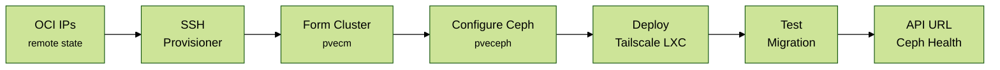

### Layer 3: Talos Deployment

---

## Network Architecture

### Physical + Logical Topology

### IP Allocation Strategy

---

## Cost Enforcement

### Free Tier Validation Flow

```mermaid
%%{init: {'theme':'forest'}}%%
graph TB
    subgraph Limits["Free Tier Limits"]
        C["Compute<br/>4 OCPU, 24GB"]
        S["Storage<br/>200GB"]
        N["Network<br/>2 Reserved IPs"]
        O["Objects<br/>20GB"]
    end
    
    subgraph TF_Val["Terraform Validations"]
        V1["variables.tf<br/>count ≤ 4"]
        V2["variables.tf<br/>ocpus ≤ 4"]
        V3["variables.tf<br/>ram ≤ 24GB"]
        V4["variables.tf<br/>storage ≤ 200GB"]
    end
    
    subgraph Checks["Pre-Deploy Checks"]
        Plan["tofu plan<br/>review"]
        Build["task build:validate<br/>< 20GB"]
    end
    
    subgraph Monitor["Runtime Monitor"]
        Budget["Budget Alert<br/>$0.01"]
        Email["Email on<br/>any charge"]
    end
    
    subgraph Validate["Post-Deploy"]
        Cost["task validate:cost"]
        Billing["OCI billing:<br/>$0.00"]
        Grafana["Grafana Cloud:<br/>within free tier"]
    end
    
    C & S & N & O --> V1 & V2 & V3 & V4
    V1 & V2 & V3 & V4 --> Plan & Build
    Plan & Build --> Budget
    Budget --> Email
    Email --> Cost
    Cost --> Billing & Grafana
    
    Billing --> Result{"$0.00?"}
    Grafana --> Result
    Result -->|Yes| Safe[("✅ Safe")]
    Result -->|No| Stop[("❌ STOP")]
    
    classDef success fill:#2d5016,stroke:#5a9216,stroke-width:3px,color:#fff
    classDef error fill:#8b0000,stroke:#ff0000,stroke-width:3px,color:#fff
    class Safe success
    class Stop error
```

### Validation Matrix

```mermaid
%%{init: {'theme':'forest'}}%%
graph LR
    V["task validate"] --> I["Images<br/><20GB"]
    V --> O["OCI<br/>free tier"]
    V --> P["Proxmox<br/>quorum"]
    V --> T["Talos<br/>ready"]
    V --> C["Cost<br/>$0.00"]
    
    I --> R{"All<br/>✓?"}
    O --> R
    P --> R
    T --> R
    C --> R
    
    R -->|Yes| Success[("✅")]
    R -->|No| Fail[("❌")]
    
    classDef success fill:#2d5016,stroke:#5a9216,stroke-width:3px,color:#fff
    classDef error fill:#8b0000,stroke:#ff0000,stroke-width:3px,color:#fff
    class Success success
    class Fail error
```

---

## Deployment Timeline

**Total time:** ~3 hours (with image builds) | ~1 hour (pre-built images)

---

## Legend

### Visual Elements

- **🌐 Internet** - Public internet
- **☁️ OCI** - Oracle Cloud Infrastructure
- **🗄️ Proxmox** - Proxmox VE hypervisor
- **🐧 Talos** - Talos Linux (immutable K8s OS)
- **📦 Applications** - Deployed workloads
- **✓** - Success state
- **❌** - Error/failure state

### Colors

- **Green (#2d5016)** - Success, ready state
- **Red (#8b0000)** - Error, failure state
- **Forest theme** - Professional, readable palette

### Abbreviations

- **OCI** - Oracle Cloud Infrastructure
- **VCN** - Virtual Cloud Network
- **IGW** - Internet Gateway
- **CNI** - Container Network Interface (Cilium)
- **PVE** - Proxmox Virtual Environment
- **LXC** - Linux Container
- **SOPS** - Secrets OPerationS (encryption)
- **CCM** - Cloud Controller Manager

---

## Related Documentation

- [PLAN.md](../PLAN.md) - Detailed deployment steps
- [QUICKSTART.md](./QUICKSTART.md) - Quick start guide
- [WARP.md](../WARP.md) - Complete architecture reference
- [Taskfile.yml](../Taskfile.yml) - All automation commands
